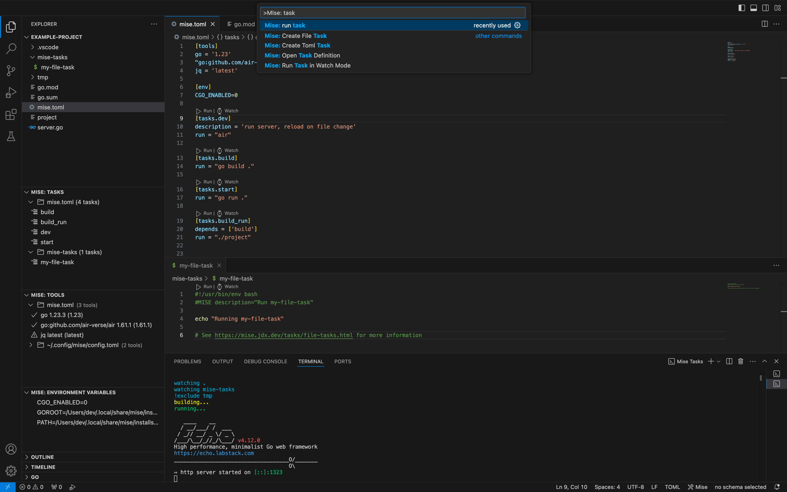

# mise-vscode 🛠️

Visual Studio Code extension for [mise](https://mise.jdx.dev/) (`mise-en-place`).

> [mise](https://mise.jdx.dev/) is a polyglot tool version manager, environment
> variables manager, and tasks runner.
>
> - Like asdf (or nvm or pyenv but for any language), it manages dev tools like
>   node, python, cmake, terraform, and hundreds more.
> - Like direnv, it manages environment variables for different project
>   directories.
> - Like make, it manages tasks used to build and test projects.

This VSCode extension provides an easy way to manage `mise`
[tasks](https://hverlin.github.io/mise-vscode/reference/tasks/),
[tools](https://hverlin.github.io/mise-vscode/reference/tools/), and
[environment variables](https://hverlin.github.io/mise-vscode/reference/environment-variables/)
directly from your editor.

It can automatically
[configure other extensions](https://hverlin.github.io/mise-vscode/reference/supported-extensions/)
to use tools provided by `mise` in your current project.

## Installation

- [VS Code Marketplace](https://marketplace.visualstudio.com/items?itemName=hverlin.mise-vscode)
- [Open VSX Registry](https://open-vsx.org/extension/hverlin/mise-vscode)

> [!NOTE]
> Note that there are [some important defaults](https://hverlin.github.io/mise-vscode/tutorials/settinguptheextension/) to be aware of whe using this extension.

## ✨ Features

### Task Management

- 🔍 Automatic detection of [mise tasks](https://mise.jdx.dev/tasks/)
- ⚡ Run tasks directly from, `mise.toml` files, file tasks, the command palette
  or the activity bar (arguments are supported)
- 📝 View task definitions
- ➕ Create new toml & file tasks
- 🔗 Go to definition, find references 
- ⚡ Autocompletion of task dependencies
- 🕸️ View graph of task dependencies

### Tool Management

- 🧰 View all [mise tools](https://mise.jdx.dev/dev-tools/) (python, node, jq,
  etc.) in the sidebar
- 📍 Quick navigation to tool definitions
- 📱 Show tools which are not installed or active
- 📦 Install/Remove/Use tools directly from the sidebar
- 🔧 Configure your other VSCode extensions to use tools provided by `mise`
  ([list of supported extensions](https://hverlin.github.io/mise-vscode/reference/supported-extensions/))

### Environment Variables

- 🌍 View [mise environment variables](https://mise.jdx.dev/environments.html)
- 📍 Quick navigation to environment variable definitions
- 🔄 Automatically load environment variables from `mise.toml` files in VS Code

### Snippets

- 📝 Snippets to create tasks in `mise.toml` and task files

### Integration with VSCode tasks (`launch.json`)

This extension lets
[VSCode tasks](https://code.visualstudio.com/docs/editor/tasks) use `mise`
tasks. You can use `mise` tasks in your `launch.json` file.

See the
[VSCode task integration docs section](https://hverlin.github.io/mise-vscode/reference/tasks/#vscode-task-integration)
for more information.

## Documentation

https://hverlin.github.io/mise-vscode/

- [Getting Started](https://hverlin.github.io/mise-vscode/tutorials/getting-started/)
- [Important Defaults](https://hverlin.github.io/mise-vscode/tutorials/getting-started/)
- [FAQ](https://hverlin.github.io/mise-vscode/explanations/faq/)
- Reference
  - [Tools](https://hverlin.github.io/mise-vscode/reference/tools/)
  - [Environment variables](https://hverlin.github.io/mise-vscode/reference/environment-variables/)
  - [Tasks](https://hverlin.github.io/mise-vscode/reference/tasks/)
  - [mise.toml language support](https://hverlin.github.io/mise-vscode/reference/misetoml-language-support/)
  - [Supported extensions](https://hverlin.github.io/mise-vscode/reference/supported-extensions/)
  - [Extension Settings](https://hverlin.github.io/mise-vscode/reference/settings/)
- Guides
  - [Bun setup](https://hverlin.github.io/mise-vscode/guides/bun/)
  - [Deno setup](https://hverlin.github.io/mise-vscode/guides/deno/)
  - [Flutter setup](https://hverlin.github.io/mise-vscode/guides/flutter/)
  - [Go setup](https://hverlin.github.io/mise-vscode/guides/golang/)
  - [Java setup](https://hverlin.github.io/mise-vscode/guides/java/)
  - [Julia setup](https://hverlin.github.io/mise-vscode/guides/julia/)
  - [Node.JS setup](https://hverlin.github.io/mise-vscode/guides/node/)
  - [PHP setup](https://hverlin.github.io/mise-vscode/guides/php/)
  - [Python setup](https://hverlin.github.io/mise-vscode/guides/python/)

## Bug Reports / Feature Requests / Contributing

- Found a bug? Please
  [open an issue](https://github.com/hverlin/mise-vscode/issues)
- Contributions are welcome! See [CONTRIBUTING.md](CONTRIBUTING.md) for more
  information.

Note that this extension is tested against the latest version of `mise`. If you
encounter an issue, make sure to update `mise` first with `mise self-update` or
using your package manager.

## Ecosystem

- See [intellij-mise](https://github.com/134130/intellij-mise) if you are
  looking for a similar plugin for IntelliJ IDEA
- [Mise documentation](https://mise.jdx.dev/)

## License

This extension is licensed under the MIT License. See the [LICENSE](LICENSE)
file for details.
