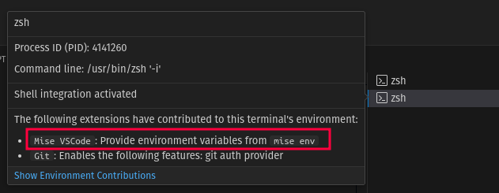
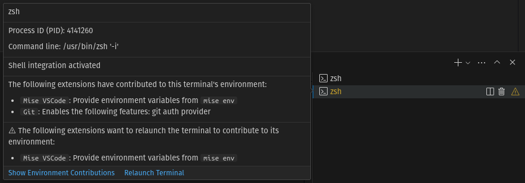

## Environment variables list

Environment variables are listed in the activity bar. Click on an environment
variable to find where it's defined.

## Loading environment variables

`mise-vscode` will automatically load all the environment variables provided by
`mise env` in the current VSCode process. (similar to the `direnv` VSCode
extension.

The variables will be provided to any newly created terminals, even if `mise` is
not activated.

If the list of environment variables has changed, you might to reload the
terminal. In this case, a warning sign will be shown next to the terminal name.

You can choose to reload open terminals automatically in the
[settings](vscode://settings/mise.updateOpenTerminalsEnvAutomatically) (off by
default). If `mise` is activated in your terminal, it's better to keep this
option turned off.

