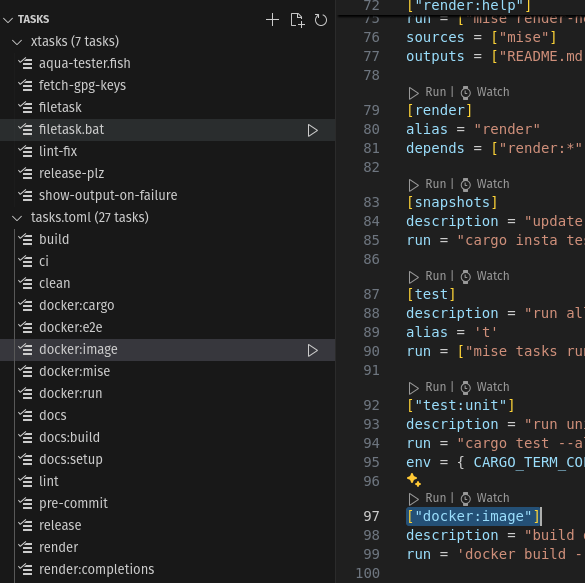
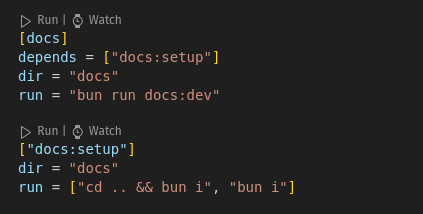
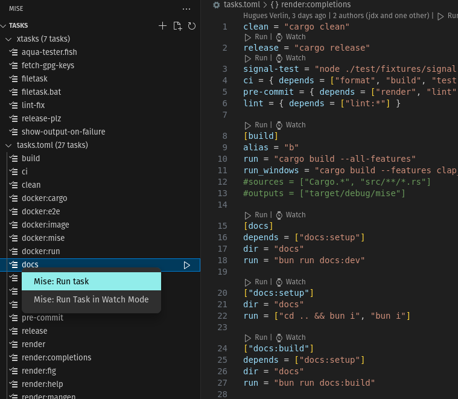
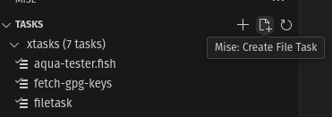
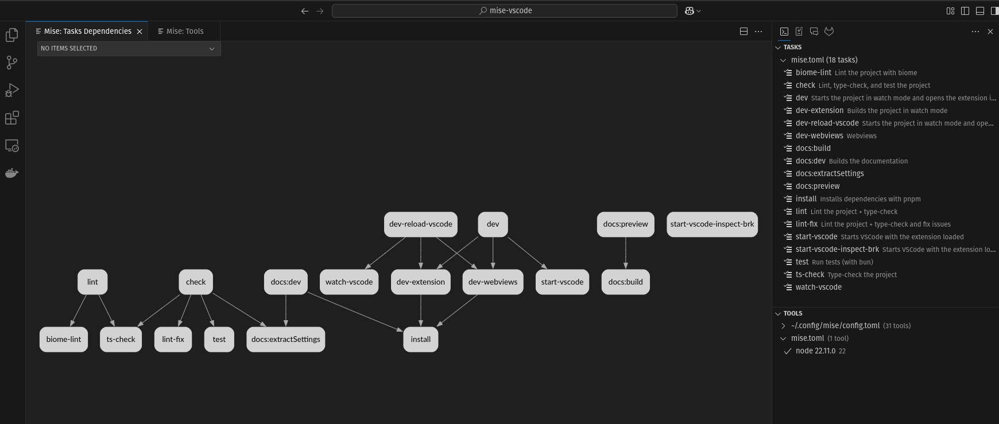

## Finding tasks

Here are a few ways to find tasks in your project:

### Using the mise activity bar



Click on a task to navigate to the file where the task is defined.

### Using the command palette

Using the command palette: `cmd|ctrl+shift+p` and search for
`Mise: Open task definition`.

## Running a task

You have several ways to run a task with the extension:

### Using the run task code lens action



Click on the run button to run the task. If some option/arguments are required,
you will be prompted to enter them.

### Using the mise activity bar



Click on the run action, or use right-click -> run task

### Using the command palette

Using the command palette: `cmd|ctrl+shift+p`, search for `Mise: run task`.
Press enter.


### VS Code task integration

This extension lets
[VS Code tasks](https://code.visualstudio.com/docs/editor/tasks) use `mise`
tasks. You can use `mise` tasks in your `launch.json` file. This allows you to
create your own shortcuts to run tasks

```json title=launch.json {5,6}
{
    "version": "2.0.0",
    "tasks": [
        {
            "type": "mise",
            "task": "build-my-app",
            "label": "Build my app",
            "watch": true
        }
    ]
}
```

**Supported parameters for mise tasks**

- `task`: The mise task to execute
- `watch`: Re-run the task when files change
- `miseEnv`: The
  [mise env](https://mise.jdx.dev/configuration/environments.html) to use
  (optional, will use the default miseEnv if not provided)
- `glob`: Glob pattern to watch for changes. Defaults to sources from the tasks
- `runArgs`: Arguments to pass to the task. Not used when watch is true
- `watchexecArgs`: Arguments to pass to `watchexec`. (example: `--clear`) | use
  `watchexec --help` for more information

## Creating a task

### Using the activity bar

You can create a file task or a toml task directly from the activity bar



### Using the command palette

Using the command palette: `cmd|ctrl+shift+p`, search for
`Mise: Create File task` or `Mise: Create Toml Task`

## Task dependencies

You can visualize the dependencies of a task by using the `Mise: Visualize Tasks Dependencies` command.


